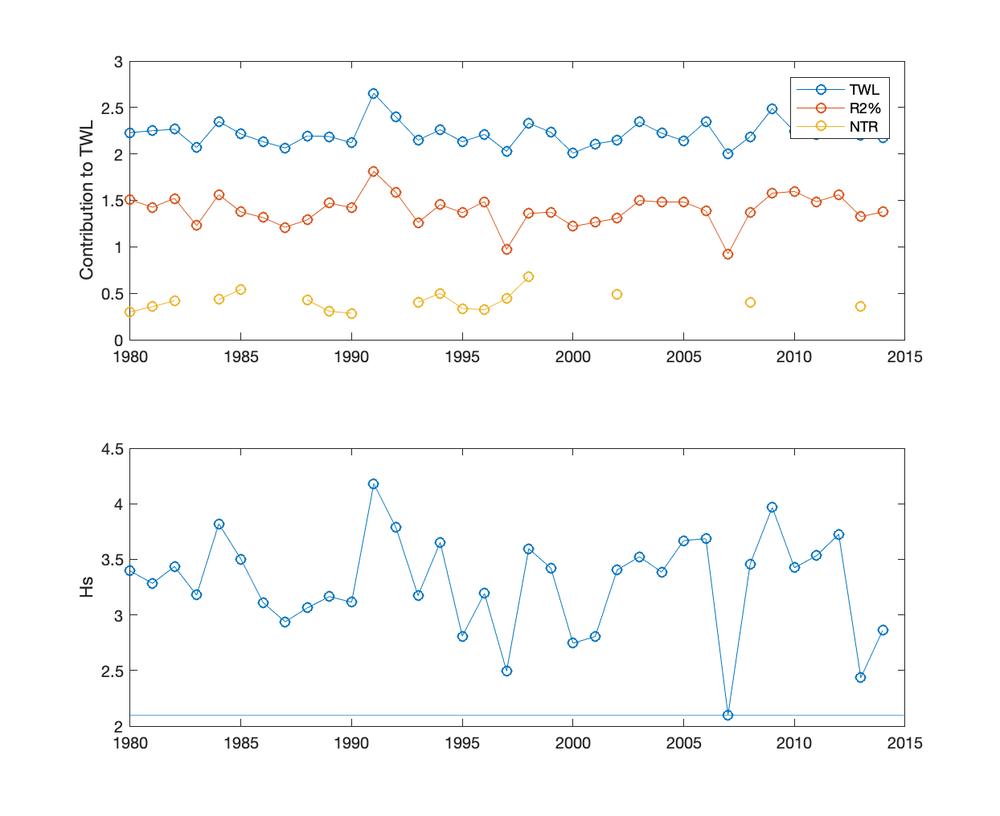
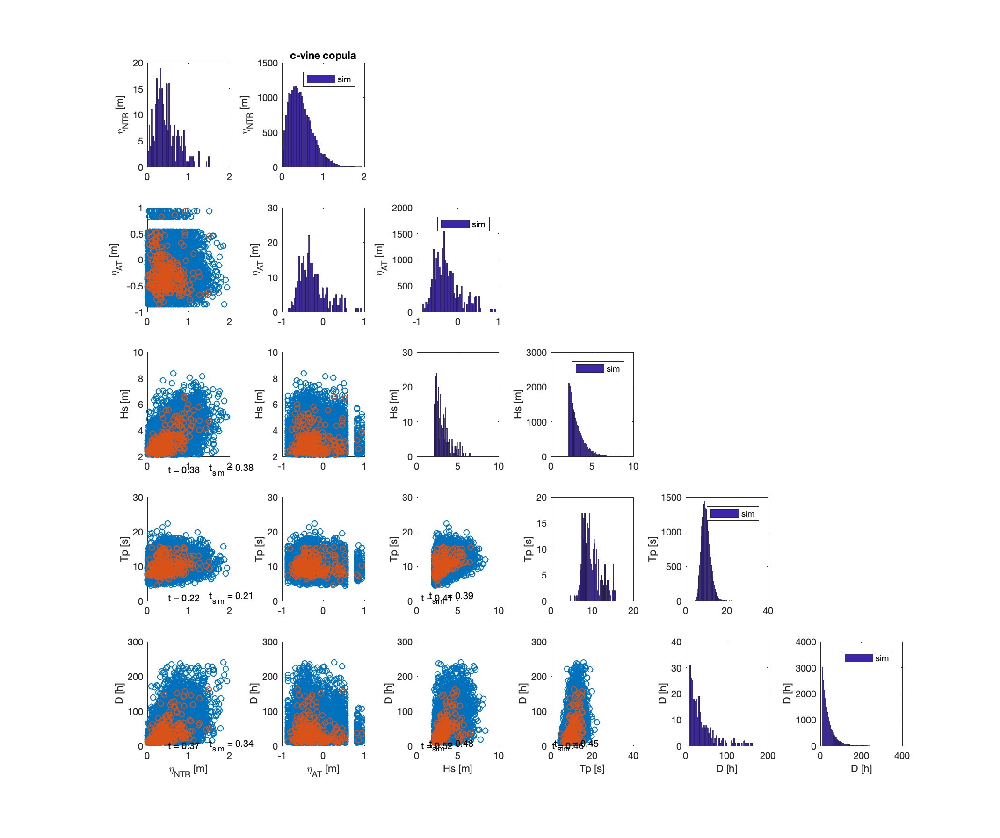

# A Multivariate Sea Storm Model

Following the methods of Wahl et al. (2016), we develop a copula-based multivariate sea-storm model (MSSM) with functionality for gaussian, t-student, and vine copulas. This text is largely taken from the notebook provided in https://github.com/UNC-CECL/Barrier3D, the model for which the MSSM was originally developed. However, the MSSM can be used to generate synthetic storms for any tide-gauge and wave hindcast data.

The MSSM model `multivariateSeaStorm.m` is written in Matlab in order to utilize the t-tide package, which allows for robust fitting of tidal constituents to water level time series, and therefore sadly cannot be run in this notebook. We provide a sample call below and describe its components herein. 

`[stStorms, stSimStorms] = multivariateSeaStorm(sCopula, sWIS_filename, sWaterLevel_filename, fBeta, fBermEl, nSimStorm, bPlot, sOutput_filename)`

The MSSM model requires the following inputs:  

`
      sCopula              - copula to be fitted to storm variables; options are "c-vine", "d-vine", "gaussian", or "t-student"
                            
      sWIS_filename        - .onlns file downloaded from a USACE Wave Information Studies (WIS) bouy; must    
                             contain hourly records of wave height (m)  
                             
      sWaterLevel_filename - .txt file that contains hourly records of total water level in m NAVD88 as second column, first column is datetime; 
                              downloaded for each year from NOAA; must be either the same length or longer than WIS time record  
                              
      fBeta                - beach slope  
      
      nSimStorm            - number of simulated storms to create  
      
      fBermEl              - erosion threshold; Wahl used 5% of dune toe heights; we use the average berm elevation (m NAVD88)  
                             
      bPlot                - boolean for plotting  
      
      sOutputFilename      - string of prefix for csv output filename  
`

In the example that follows, we utilize a 35 year record of hourly wave hindcast data – including wave height (Hs) and wave period (Tp) – from the USACE’s Wave Information Studies buoy offshore Hog Island in the Virginia Coast Reserve (Station 63183, 22 m water depth) and hourly records of water level from the nearest NOAA tide gauge (Station 8631044, Wachapreague, VA) to create a list of 20,000 synthetic storms. We specify a berm elevation of 1.9 m (the average along Hog Island) and beach slope of 0.04. The c-vine produced the highest $\tau$ values (Kendall's Corelation Coefficient) -- over the elliptical Gaussian and T-student copulas, as well as the d-vine copula -- and is therefore shown here.

`[stStorms, stSimStorms] = multivariateSeaStorm("c-vine", "ST63183_v03.onlns", "Tide-8631044-Combined.txt", 0.04, 1.9, 20000, true, "StormList_20k_VCR_Berm1pt9m_Slope0pt04.csv")`

  

Within `multivariateSeaStorm.m`, we first process the data by removing the 365-day (1 yr) running median. This differs from the 30-day running median used in Wahl et al. (2016), namely because we desired to maintain seasonal trends and only account for non-stationarity in wave and water level parameters due to inter-annual and decadal variability. The median of the last 3 years is then applied to the entire time series such that the new time series is representative of the current climate. A year-by-year tidal analysis is performed using t_Tide (Pawlowicz et al., 2002) to obtain the tidal amplitude $\eta_A$ and non-tidal residual $\eta_{NTR}$. Lastly, the representative highest elevation of the landward margin of runup (Rhigh, i.e. the total water level) is calculated as the sum of the maximum 2% exceedance of runup, following Stockdon et al. (2006), and the contemporaneous (corrected) water level elevation from the tide gauge. The representative lowest runup elevation (Rlow), below which any part of the barrier is considered continuously subaqueous during a storm, is taken as Rhigh – swash/2 (Figure 1). While wave direction is processed as part of the MSSM, it is not required as input for Barrier3D and is therefore not discussed herein.

### Figure 1. Timeseries corrected for non-stationarity due to inter-annual and decadal variability 

Storm events are then extracted from the corrected time series using the same metrics as Wahl et al. (2016), i.e., we derive a set of storm events by conditioning on Hs. Events are identified as periods of 8 or more consecutive hours with deep-water significant wave heights greater than 2.1 m, or rather the minimum monthly averaged wave height for periods in which waters levels exceed the berm elevation (Figure 2). The remaining variables used to define the independent multivariate storm events for use in Barrier3D include $\eta_A$, $\eta_{NTR}$, $Tp$, and storm duration. We discard storms with concomitant values of surge that are negative and identify new storms when Hs drops below the 2.1 m threshold for 24 hours or more (cf. Li et al., 2014). This method results in 282 independent multivariate sea-storm events for the example inputs shown here.

### Figure 2. Wave height threshold used to define storms (i.e., the minimum monthly averaged wave height for periods when the TWL exceeded the berm elevation).

### Figure 3. Histograms of the empirical and synthetic storms

We *slightly* improve upon the copula-based approach of Wahl et al. (2016) for modeling the interdependencies between sea-storm variables through the use of vine copulas, a class of copulas that has been shown to outperform standard higher dimensional copulas in hydrologic applications (e.g., Daneshkhah et al., 2016; Jane et al., 2020) and does a slightly better job here. The MvCAT toolbox (Sadegh et al., 2017) is first used to find marginal distributions that best fit each variable ($\eta_{NTR}$: Weibull; Hs and storm duration: Generalized Pareto; Tp: Generalized Extreme Value). The observed data are then transformed to the copula scale (the unit hypercube) by finding their rank and then rescaling the ranks by 1/(N+1) where N = 282 events. Using the VineCopula R package (Nagler et al., 2020), we fit a C-vine, D-vine, and t-Student copula (as used in Wahl et al. (2016)) to the transformed four-dimensional data set in order to identify the most suitable copula for modeling interdependencies (the program `mssmVines.R` is called from within Matlab). We found through comparison of Kendall’s correlation coefficient $\tau$ that the C-vine best captures the underlying dependence structure. We then generate 20,000 random samples (quadruplets) from the C-vine copula and then use the inverse of the fitted marginal CDFs to transform the simulated data from unit hypercube space back to the original scale of the data. As the tidal amplitude varies within a restricted range, we sample $\eta_A$ directly from its empirical CDF for each of the 20,000 synthetic storm events.
