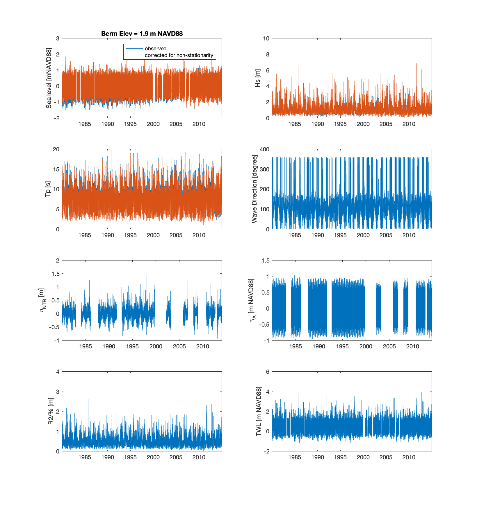

# A Multivariate Sea Storm Model

Following the methods of Wahl et al. (2016), we develop a copula-based multivariate sea-storm model (MSSM) with functionality for gaussian, t-student, and vine copulas. The example MSSM model below is developed using wave hindcast and water-level data from the Virgina Coastal Reserve. This text is largely taken from the notebook provided in https://github.com/UNC-CECL/Barrier3D, the model for which the MSSM was originally developed; however, the MSSM can be used to generate synthetic storms for any tide-gauge and wave hindcast data.

The MSSM model `multivariateSeaStorm.m` is written in Matlab in order to utilize the t-tide package, which allows for robust fitting of tidal constituents to water level time series, and therefore sadly cannot be run in this notebook. We provide a sample call below and describe its components herein. 

`[stStorms, stSimStorms] = multivariateSeaStorm(sCopula, sWIS_filename, sWaterLevel_filename, fBeta, fBermEl, nSimStorm, bPlot, sOutput_filename)`

The MSSM model requires the following inputs: 

`
% Inputs:
%       sCopula              - copula to be fitted to storm variables; options are "c-vine", "d-vine", "gaussian",  
%                             or "t"
%       sWIS_filename        - .onlns file downloaded from a USACE Wave Information Studies (WIS) bouy; must 
%                              contain hourly records of wave height (m)
%       sWaterLevel_filename - .txt file that contains hourly records of total water level in m NAVD88 as second 
%                              column, first column is datetime; downloaded for each year from NOAA;
%                              must be either the same length or longer than WIS time record
%       fBeta                - beach slope 
%       nSimStorm            - number of simulated storms to create
%       fBermEl              - erosion threshold; Wahl used 5% of dune toe heights; we use the average berm 
%                              elevation (m NAVD88)
%       bPlot                - boolean for plotting
%       sOutputFilename      - string of prefix for csv output filename
`

In the example that follows, we utilize a 35 year record of hourly wave hindcast data – including wave height (Hs) and wave period (Tp) – from the USACE’s Wave Information Studies buoy offshore Hog Island in the Virginia Coast Reserve (Station 63183, 22 m water depth) and hourly records of water level from the nearest NOAA tide gauge (Station 8631044, Wachapreague, VA) to create a list of 20,000 synthetic storms. We specify a berm elevation of 1.9 m (the average along Hog Island) and beach slope of 0.04. The c-vine produced the highest $\tau$ values (Kendall's Corelation Coefficient) -- over the elliptical Gaussian and T-student copulas, as well as the d-vine copula -- and is therefore shown here.

`[stStorms, stSimStorms] = multivariateSeaStorm("c-vine", "ST63183_v03.onlns", "Tide-8631044-Combined.txt", 0.04, 1.9, 20000, true, "StormList_20k_VCR_Berm1pt9m_Slope0pt04.csv")`

  

Within `multivariateSeaStorm.m`, we first process the data by removing the 365-day (1 yr) running median. This differs from the 30-day running median used in Wahl et al. (2016), namely because we desired to maintain seasonal trends and only account for non-stationarity in wave and water level parameters due to inter-annual and decadal variability. The median of the last 3 years is then applied to the entire time series such that the new time series is representative of the current climate. A year-by-year tidal analysis is performed using t_Tide (Pawlowicz et al., 2002) to obtain the tidal amplitude $\eta_A$ and non-tidal residual $\eta_{NTR}$. Lastly, the representative highest elevation of the landward margin of runup (Rhigh, i.e. the total water level) is calculated as the sum of the maximum 2% exceedance of runup, following Stockdon et al. (2006), and the contemporaneous (corrected) water level elevation from the tide gauge. The representative lowest runup elevation (Rlow), below which any part of the barrier is considered continuously subaqueous during a storm, is taken as Rhigh – swash/2 (Figure 1). While wave direction is processed as part of the MSSM, it is not required as input for Barrier3D and is therefore not discussed herein.

### Figure 1. Timeseries corrected for non-stationarity due to inter-annual and decadal variability 
